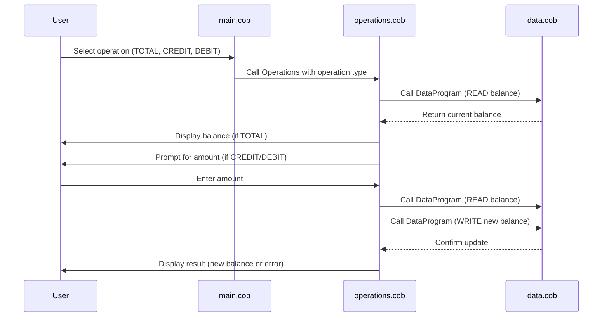

# COBOL Student Account System Documentation

This project contains COBOL programs for managing student accounts, including balance inquiries, credits, and debits. Below is an overview of each COBOL file and the key business rules implemented.

## File Overview

### `main.cob`
**Purpose:**
- Serves as the main entry point for the student account system.
- Handles user interaction and delegates operations to other modules.

**Key Functions:**
- Presents options to the user (e.g., check balance, credit, debit).
- Calls the `Operations` program to perform the requested action.

### `operations.cob`
**Purpose:**
- Implements the core logic for account operations: balance inquiry, credit, and debit.

**Key Functions:**
- Receives the operation type (e.g., TOTAL, CREDIT, DEBIT) via linkage.
- For `TOTAL`: Reads and displays the current balance.
- For `CREDIT`: Prompts for a credit amount, adds it to the balance, and updates the record.
- For `DEBIT`: Prompts for a debit amount, checks for sufficient funds, subtracts from the balance if possible, and updates the record.

**Business Rules:**
- Debit operations are only allowed if the account has sufficient funds; otherwise, an error message is displayed.
- All balance updates are performed via calls to the `DataProgram` module.

### `data.cob`
**Purpose:**
- Handles persistent storage and retrieval of student account balances.

**Key Functions:**
- Provides `READ` and `WRITE` operations for accessing and updating the account balance.
- Ensures data integrity for student account transactions.

## Business Rules for Student Accounts
- **Balance Inquiry:** Students can view their current account balance at any time.
- **Credit:** Students can add funds to their account. The credited amount is immediately reflected in the balance.
- **Debit:** Students can withdraw funds only if their account has sufficient balance. Attempts to debit more than the available balance are rejected with an appropriate message.
- **Data Integrity:** All operations that modify the balance are routed through the data management module to ensure consistency.

---

## Sequence Diagram: Data Flow

---
For further details, refer to the source code in the `src/cobol/` directory.